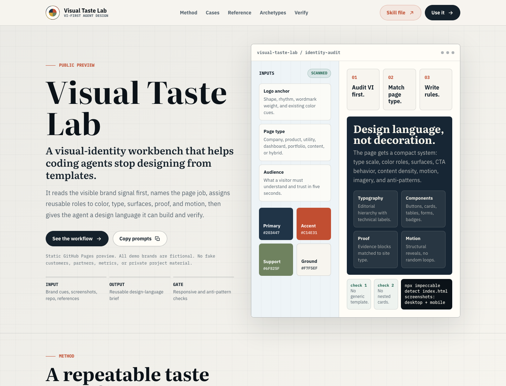
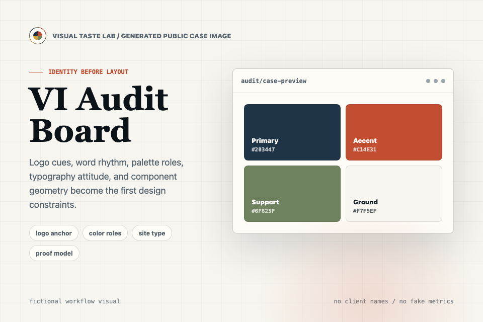
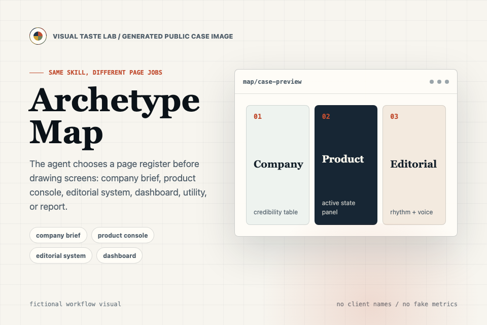
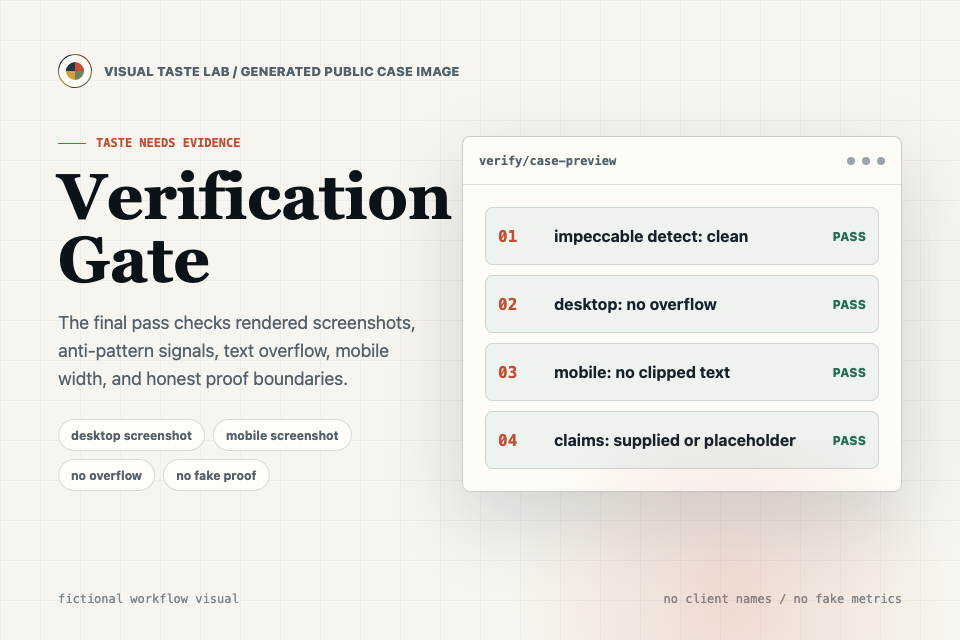

# Visual Taste Lab

Make coding agents design from visual identity, not from generic templates.
让编程 Agent 先理解视觉身份，再开始写页面。

[Public Preview / 在线预览](https://siuserxiaowei.github.io/visual-taste-lab/) · [Skill File / Skill 文件](visual-taste-lab/SKILL.md) · [Examples / 示例](examples/)



## What It Is / 它是什么

Visual Taste Lab is a design-language skill for Codex, Claude Code, and similar coding agents. It gives an agent a practical loop: audit visual identity, classify the page job, distill reusable design rules, apply them system-first, and verify the rendered result.

Visual Taste Lab 是一个面向 Codex、Claude Code 等编程 Agent 的设计语言 Skill。它把“做得更好看”拆成可执行闭环：先审计视觉身份，判断页面任务，提炼可复用设计规则，系统优先落地，最后用渲染结果验收。

It is not a theme pack, component library, hosted design service, or promise of automatic taste. It is a workflow and reference set for making visual decisions explicit before code changes begin.

它不是主题包、组件库、托管式设计服务，也不承诺“一键审美”。它提供的是一套工作流和参考，让 Agent 在改代码前先把视觉判断说清楚。

## Preview Images / 预览图

The images below are generated public teaching assets. They are not real customer case studies and do not imply adoption, metrics, or client work.

下面这些图片是为公开展示生成的教学型案例图，不是真实客户案例，也不暗示用户量、指标或客户成果。

| VI Audit | Archetype Map | Verification Gate |
|---|---|---|
|  |  |  |

## Why / 为什么

AI-built webpages often fail in the same ways: generic SaaS heroes, purple-blue gradients, nested cards, random accent colors, and confident claims with no proof. Visual Taste Lab makes the first step explicit:

AI 生成页面常见的问题很集中：通用 SaaS 首屏、紫蓝渐变、卡片套卡片、随意强调色、没有依据的可信度文案。Visual Taste Lab 把第一步说清楚：

- What visual anchors already exist in the logo, wordmark, product, screenshots, or references?
- Is this a company site, product website, transactional utility, dashboard, portfolio, institutional page, or another type?
- Which colors, typography, spacing, surfaces, components, imagery, and motion rules should be reused?
- What should the interface avoid so it does not become another generic AI page?

- Logo、字标、产品、截图或参考里已经有哪些视觉锚点？
- 它是公司官网、产品网站、交易工具、后台、作品集、机构页面，还是其他类型？
- 颜色、字体、间距、界面表面、组件、图片和动效应该遵循什么规则？
- 这个界面要避免什么，才不会变成又一个模板化 AI 页面？

## What's Included / 包含内容

- `visual-taste-lab/SKILL.md`: the agent workflow, guardrails, output contract, and acceptance checklist.
- `visual-taste-lab/references/archetypes.md`: visual archetypes for company sites, product pages, dashboards, portfolios, utilities, and more.
- `visual-taste-lab/references/design-language-template.md`: a reusable brief format for design-language output.
- `docs/design-language.md`: the current public-preview design language.
- `docs/impeccable-reference-audit.md`: notes on what this project learned from the Impeccable reference without copying its brand.
- `assets/cases/`: generated fictional workflow images used in the public preview and README.
- `examples/`: copyable goal prompts and a fictional design-language sample.
- `index.html`: a static public preview page for the project.

- `visual-taste-lab/SKILL.md`：Agent 工作流、约束、输出契约和验收清单。
- `visual-taste-lab/references/archetypes.md`：公司官网、产品页、后台、作品集、工具站等视觉原型。
- `visual-taste-lab/references/design-language-template.md`：可复用的设计语言简报模板。
- `docs/design-language.md`：当前公开预览页的设计语言。
- `docs/impeccable-reference-audit.md`：记录本项目如何学习 Impeccable 参考，但不复制其品牌。
- `assets/cases/`：公开预览页和 README 使用的虚构工作流案例图。
- `examples/`：可复制的目标 prompt 和虚构设计语言样例。
- `index.html`：本项目的静态公开预览页。

## Install / 安装

Clone or download this repository, then copy the skill folder into your local Skills directory.

克隆或下载本仓库，然后把 Skill 文件夹复制到本地 Skills 目录。

For Codex:

```bash
cp -R visual-taste-lab ~/.codex/skills/
```

For Claude Code-style local Skills, if your environment supports it:

```bash
cp -R visual-taste-lab ~/.claude/skills/
```

Then invoke it in a task with `$visual-taste-lab`.

安装后，在任务中通过 `$visual-taste-lab` 调用。

## Use Cases / 使用场景

Use Visual Taste Lab when you want an agent to:

当你希望 Agent 完成这些工作时，可以使用 Visual Taste Lab：

- improve an existing website without turning it into a generic template;
- create a design-language brief before implementation;
- derive visual direction from screenshots, URLs, logos, or brand references;
- tighten shared tokens, components, and page patterns;
- run a focused UI pass on a landing page, dashboard, portfolio, utility, or institutional page.

- 在不套模板的前提下提升现有网站质感；
- 先产出设计语言简报，再进入实现；
- 从截图、URL、Logo 或品牌参考中提炼视觉方向；
- 收紧共享 token、组件和页面模式；
- 针对落地页、后台、作品集、工具站或机构页面做局部 UI 优化。

## Workflow / 工作流

1. **Collect references / 收集参考**
   Read the current codebase, screenshots, URLs, logo, brand notes, or inspiration links.

2. **Run a VI audit / 进行 VI 审计**
   Identify logo cues, color roles, typography attitude, geometry, imagery, and current UI patterns.

3. **Classify the project / 判断项目类型**
   Decide whether the work is mainly a company site, product site, dashboard, portfolio, utility, institutional page, or another type.

4. **Distill the design language / 提炼设计语言**
   Define reusable rules for color, type, spacing, radius, surfaces, buttons, cards, forms, tables, CTAs, imagery, motion, and anti-patterns.

5. **Apply system-first / 先落系统**
   Update shared styles and components before polishing isolated sections.

6. **Verify / 验收**
   Run build or tests when applicable, check desktop and mobile, prevent horizontal overflow, and keep all claims honest.

## Expected Outputs / 预期输出

For a real project, the skill usually asks the agent to produce:

在真实项目中，Skill 通常会要求 Agent 交付：

- a short VI brief with visual anchors and site-type decision;
- a reusable design-language brief, often as `docs/design-language.md` or a project-local equivalent;
- updated shared styles, tokens, or components when implementation is requested;
- 2-4 key pages or surfaces redesigned or tightened when the scope allows;
- verification notes with build/test results or a clear reason verification was not possible.

- 一份简短 VI 简报，说明视觉锚点和页面类型判断；
- 一份可复用设计语言简报，通常是 `docs/design-language.md` 或项目内等价文件；
- 在需要实现时，更新共享样式、token 或组件；
- 在范围允许时，优化 2-4 个关键页面或界面；
- 验收说明，包含构建/测试结果，或说明为什么无法验证。

## Copyable Prompt / 可复制 Prompt

```text
/goal Use $visual-taste-lab to improve this project visually.

Do not redesign immediately. First run a VI audit, classify the site type,
distill a reusable design language, and only then update the relevant
pages/components.

Constraints:
- Do not invent customers, case studies, metrics, partners, or proof.
- Do not leak private project names, credentials, internal metrics, or unreleased plans.
- Keep mobile layouts free of horizontal overflow.
- Run build or tests when applicable.
- Summarize the visual direction, changed files, verification, and remaining assumptions.
```

More prompts are available in [examples/goal-prompts.md](examples/goal-prompts.md).

更多可复制 prompt 见 [examples/goal-prompts.md](examples/goal-prompts.md)。

## Public Preview / 在线预览

The public preview is a static project page hosted on GitHub Pages: [siuserxiaowei.github.io/visual-taste-lab](https://siuserxiaowei.github.io/visual-taste-lab/).

在线预览是托管在 GitHub Pages 上的静态项目页：[siuserxiaowei.github.io/visual-taste-lab](https://siuserxiaowei.github.io/visual-taste-lab/)。

It demonstrates the project positioning and examples. It does not run a hosted design analysis service, collect submissions, or process private project files.

它用于展示项目定位和示例，不提供托管式设计分析服务，不收集提交内容，也不处理私有项目文件。

## Privacy Boundary / 隐私边界

This repository should only contain public docs, fictional examples, generic scenarios, and reusable skill references. Do not commit private screenshots, customer names, internal metrics, credentials, unreleased strategy, or proprietary project details.

本仓库只应包含公开文档、虚构示例、通用场景和可复用 Skill 参考。不要提交私有截图、客户名称、内部指标、凭证、未公开策略或专有项目细节。

When using the skill on private work, ask the agent to extract visual attributes instead of repeating sensitive business specifics.

在私有项目中使用时，应要求 Agent 提炼视觉属性，而不是复述敏感业务信息。

## Repository Structure / 仓库结构

```text
visual-taste-lab/
├── SKILL.md
├── agents/
│   └── openai.yaml
└── references/
    ├── archetypes.md
    └── design-language-template.md
```

## License / 许可证

MIT. See [LICENSE](LICENSE).
